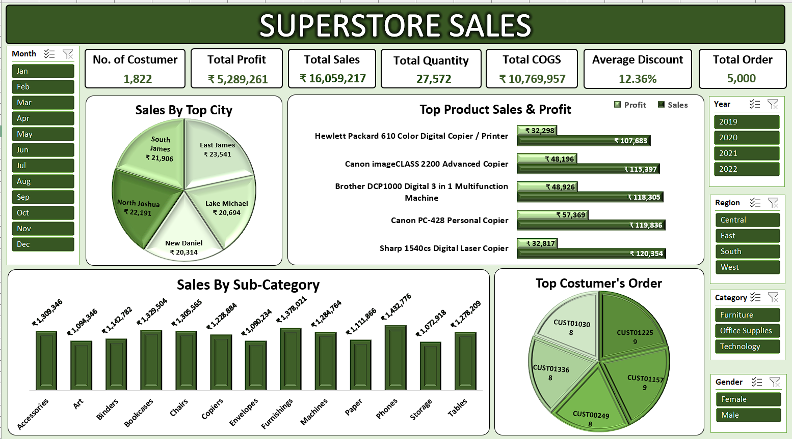

# 🛒 Superstore Sales Dashboard – Excel Project

## 📊 Overview
This Excel project analyzes a fictional Superstore's sales data to uncover key business insights using advanced Excel features. It includes a cleanly formatted dashboard built on Pivot Tables, slicers, KPIs, and dynamic charts.

---

## 🔧 Tools & Features Used
- **Microsoft Excel**
- Pivot Tables & Pivot Charts
- Interactive **Slicers**
- Key Performance Indicators (**KPIs**)
- Dashboard Formatting & Layout Best Practices

---

## 📈 Insights & Key Highlights
- 📌 **Total Sales, Total Profit, Total Quantity, Total Cost of goods(COGS), Average Discount, No. of Costumer and Total Order** visualized using KPIs
- 🔍 **Top 5 Products** by Sales and Profit
- 🧭 **Sales by Top 5 City & Sub-Category** with comparative analysis Using Slicers
- 🧭 **Top 5 Costumer and Their Orders** with comparative analysis Using Slicers
---

## 🧠 Business Use Case
This dashboard simulates how a retail company can:
- Track performance across products and regions
- Identify profitable categories
- Make data-driven decisions using Excel without external BI tools

---

## 📷 Screenshots
  

---

## 📁 File Structure
- `Raw Data`: Original transactional data
- `Pivot Tables`: Aggregated insights for dashboard backend
- `Dashboard`: Final interactive dashboard with slicers and KPIs

---

## 🚀 How to Use
1. Open `Superstore Sales Data.xlsx` in Excel
2. Navigate to the **Dashboard** sheet
3. Use the slicers (e.g., Category, Region, Gender, Year, Month) to interact with the visuals
4. All data updates automatically from the Pivot Table base

---

## 📎 License
This project is for educational and portfolio purposes only.
